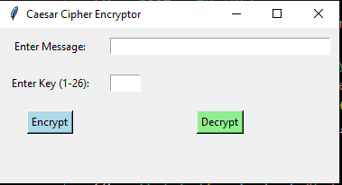
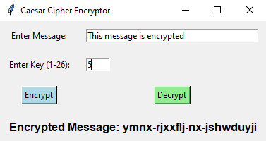
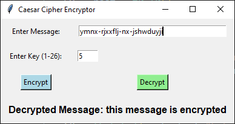

# Caesar Cipher Encryptor

Caesar Cipher Encryptor is a simple GUI-based encryption tool built using Python and Tkinter. It allows users to encrypt and decrypt text using the Caesar cipher algorithm, a basic form of encryption where each letter in the plaintext is shifted by a fixed number of positions in the alphabet.

## Project Overview

The Caesar Cipher Encryptor is a graphical user interface (GUI) application designed to encrypt and decrypt messages using the Caesar cipher technique. The Caesar cipher is one of the simplest encryption methods, where each letter in the plaintext is shifted by a certain number of positions down or up the alphabet. The app allows users to input a message, select a shift key, and then view the encrypted or decrypted output in real-time. 

Key features of the project include:

- A user-friendly interface where users can input plaintext or ciphertext.
- An option to select a shift key for encryption or decryption.
- Real-time encryption and decryption with a simple button click.
- A secure method for encrypting messages using the Caesar cipher algorithm.

## Technologies Used

- **Python**: The core programming language used to implement the Caesar cipher encryption and decryption logic.
- **Tkinter**: A Python library for building the graphical user interface (GUI), making the app interactive and easy to use.
- **String Manipulation**: Python's built-in string functions are used to perform the encryption and decryption by shifting characters in the alphabet.

## Features
- User-friendly graphical interface using Tkinter
- Encrypt text by shifting letters forward
- Decrypt text by shifting letters backward
- Adjustable shift value for encryption and decryption
- Support for uppercase and lowercase letters
- Basic input validation to prevent errors

## Installation
To run the Caesar Cipher Encryptor, ensure you have Python installed on your system. You can install the required dependencies using:

```bash
pip install tkinter
```

## Usage
Run the script using the following command:

```bash
python caesar_cipher.py
```

1. Enter the text you want to encrypt or decrypt.
2. Choose the shift value.
3. Click the "Encrypt" or "Decrypt" button to get the result.

## Images




## Contribution
Feel free to contribute by submitting issues or pull requests.